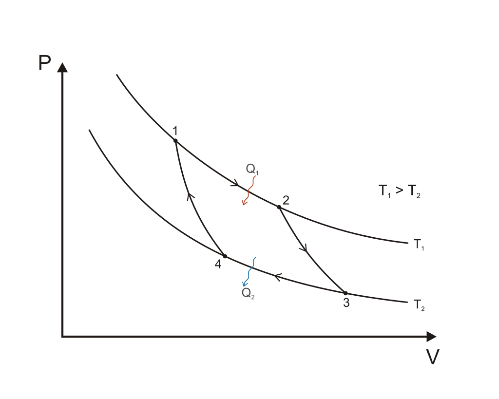

# Lämpövoimakoneet

Lämpövoimakoneiden yleinen toimintaperiaate on seuraava: kone ottaa lämpöenergiaa $Q_H$ niinsanotusta kuumasäiliöstä (H=hot), muuttaa osan lämpöenergiasta työksi $W$, ja poistaa ylimääräisen energian $Q_C$ kylmäsäiliöön (C=cold). Energian säilymislain mukaisesti $Q_H=W+Q_C$, joten tehty työ on $W=Q_H-Q_C$.

Kuumasäiliö voi sisältää esimerkiksi bensiinin palamisessa syntyvää kuumaa kaasua. Työ on käytännössä sitä, että kaasu työntää mäntää ja siten saa aikaan liikettä, joka voidaan muuttaa esimerkiksi pyörimiseksi. Kylmäsäiliön kaasut ovat pakokaasuja.

Koneen hyötysuhde $\eta$ tarkoittaa tehdyn työn ja käytetyn energian suhdetta. Lämpövoimakoneessa siis pätee 

$\eta=\frac{W}{Q_H}$

Toisaalta kun työn paikalle sijoitetaan energian säilymisestä saatu kaava $W=Q_H-Q_C$, saadaan

$\eta=\frac{Q_H-Q_C}{Q_H}=1-\frac{Q_C}{Q_H}$

Hyötysuhde voidaan esittää myös vastaavien tehosuureiden $\Phi_H$ ja $\Phi_C$ avulla. Tällöin työn $W$ paikalle tulee laitteen teho $P$. Tehosuureiden avulla esitetty hyötysuhde on

$\eta=\frac{P}{\Phi_H}$ tai $\eta=1-\frac{\Phi_C}{\Phi_H}$

::::{admonition} Esimerkki

Täydennä seuraavista lämpövoimakoneista a, b, c ja d puuttuvat tiedot.

|suure|a|b|c|d|
|-----|-|-|-|-|
|$\Phi_H$|320 kW|?|1200 kW|?|
|$\Phi_C$|?|?|?|42 MW|
|$P$|140 kW|800 MW|?|?|
|$\eta$|?|0.60|0.40|0.43|

:::{admonition} Ratkaisu
:class: tip, dropdown

a) Lasketaan ensin hukkateho $\Phi_C=\Phi_H-P=(320-140)~\text{kW}=180~\text{kW}$

Hyötysuhde on $\eta=\frac{P}{\Phi_H}=\frac{140~\text{kWH}}{320~\text{kWh}}=0.44$

b) Lasketaan kuumasäiliöstä otettava teho $\Phi_H$ hyötysuhteen $\eta$ ja tehon $P$ perusteella:

$\Phi_H=\frac{P}{\eta}=\frac{800~\text{MW}}{0.60}=1333~\text{MW}$

Hukkateho on $\Phi_C=\Phi_H-P=(1333-800)~\text{MW}=533~\text{MW}$

c) Aloitetaan laskemalla hukkateho 

$\Phi_C=1200~\text{kW}\cdot(1-0.4) = 720~\text{kW}$

Tehoksi saadaan $P=\eta \Phi_H=0.4\cdot 1200~\text{kW}=480~\text{kW}$ tai toisaalta $P=Q_H-Q_C=(1200-720)~\text{kW}=420~\text{kW}$

d) Ottotehoksi saadaan ratkaistua $\Phi_H=\frac{\Phi_C}{1-\eta}$ eli

$\Phi_H=\frac{42~\text{MW}}{1-0.43}=74~\text{MW}$

ja tuotettu teho on $P=\Phi_H-\Phi_C-P=(74-42)~\text{MW}=32~\text{MW}$

:::

::::

## Moottoreita

Esimerkkeinä lämpövoimakoneista tarkastellaan bensiini- ja diesel-moottoreita. Kummassakin moottorissä mäntä liikkuu edestakaisin. Kun mäntä on mahdollisimman alhaalla, kaasun tilavuus on suurimmillaan ja sen suuruus on $V_1$. Kun mäntä on mahdollisimman ylhäällä, kaasun tilavuus on pienimmillään ja sen suuruus on $V_2$. Moottorin puristussuhde $r$ tarkoittaa näiden tilavuuksien suhdetta: $r=V_1/V_2$.

**Bensiinimoottorin** keksi Nikolaus Otto, ja siksi sitä nimitetään myös Otto-moottoriksi. Bensiinimoottorin toiminnan vaiheet ovat seuraavat:

1. Kaasu puristuu adiabaattisesti tilavuudesta $V_1 = rV_2$ tilavuuteen $V_2$. Samalla sen paine kasvaa. Lämpötila nousee arvosta $T_1$ arvoon $T_2$.
2. Sytytystulpan kipinä sytyttää kaasun palamaan. Palo tapahtuu räjähtämällä vakiotilavuudessa. Palamisen lämpö toimii lämpöenergiana $Q_H$. Kaasun paine kasvaa edelleen. Kaasun lämpötila nousee arvosta $T_2$ arvoon $T_3$.
3. Kaasu laajenee adiabaattisesti tilavuuteen $V_1$. Samalla kaasu tekee työtä $W$ liikuttamalla sylinterin mäntää. Kaasu jäähtyy lämpötilaan $T_4$.
4. Kaasu jäähtyy edelleen lämpötilaan $T_1$ ja sen painee laskee. Lämpö poistuu pakokaasun mukana hukkalämpönä $Q_C$.

Puristussuhde bensiinimoottorissa on tyypillisesti $r=8$. Hyötysuhteeksi voidaan johtaa $\eta=1-r^{1-\gamma}$. Kun tähän sijoitetaan $r=8$ ja palavan kaasun adiabaattinen vakio $\gamma=1.4$, saadaan teoreettiseksi hyötysuhteeksi $\eta=1-8^{-0.4}=0.56$.

Hyötysuhteen laskukaavasta nähdään, että bensiinimoottorin hyötysuhdetta voidaan kasvattaa nostamalla puristussuhdetta $r$. Jos puristussuhde on liian suuri, bensiini voi syttyä palamaan itsestään ennen sytytystulpan kipinää. Tätä voidaan estää käyttämällä bensiiniä, jossa on korkeampi puristuksen kestävyys. Kestävyyttä kuvaa bensiinin oktaaniluku.

(Oktaaniluku on kokeellisesti määritettävä prosenttiosuus. Esimerkiksi 98-oktaaninen bensiini käyttäytyy moottorissa samalla tavalla kuin jos bensiinissä olisi 98 % oktaani-molekyyleja $C_8H_{18}$. Käytännössä bensiiniin lisätään muita aineita kuin oktaania. Aiemmin käytetty lisäaine sisälsi lyijyä, mutta se kiellettiin ympäristösyistä. Nykyinenkään lisäaine, metyylitertiääributyylieetteri, ei ole ympäristön kannalta ongelmaton.)

**Dieselmoottorin** keksijä oli Rudolf Diesel. Dieselmoottori toimii seuraavasti:

1. Mäntä puristaa sylinteriin vedettyä ulkoilmaa adiabaattisesti tilavuudesta $V_1$ tilavuuteen $V_2$. Kaasun lämpötila nousee arvosta $T_1$ arvoon $T_2$ ja paine kasvaa. Loppulämpötila määräytyy puristussuhteen ja adiabaattisen prosessin laskukaavan perusteella.
2. Kuumaa ilmaa sisältävään sylinteriin ruiskutetaan polttoainetta. Polttoaine palaa, ja kaasun tilavuus laajenee vakiopaineessa tilavuuteen $V_3$. Tilavuuksien $V_3$ ja $V_2$ suhde $\phi$ on nimeltään ruiskutussuhde, $\phi=V_3/V_2$. Kaasun lämpötila kasvaa arvoon $T_3$. Polttoaineesta saatava lämpöenergia on $Q_H$.
3. Kaasu laajenee adiabaattisesti tilavuuteen $V_2$, ja samalla työntää mäntää ja tekee työn $W$. Samalla kaasu jäähtyy lämpötilaan $T_4$.
4. Poistoventtiili aukeaa, kaasun paine laskee, ja hukkalampö $Q_C$ poistuu. Kaasun lämpötila palautuu arvoon $T_1$.

Diesel-moottorin hyötysuhteelle voidaan johtaa laskukaava

$\eta=1-\frac{1}{\gamma r^{\gamma-1}}\frac{\phi^{\gamma}-1}{\phi-1}$

Tässäkin tapauksessa puristussuhteella on suuri vaikutus hyötysuhteeseen.

::::{admonition} Hyötysuhteiden kaavojen perustelu

:::{admonition} Bensiinimoottori
:class: tip, dropdown

Hyötysuhde määritellään $\eta=1-\frac{Q_C}{Q_H}$. Bensiinimoottorin tapauksessa polttoaineesta saatu lämpöenergia on $Q_H=mc(T_3-T_2)$, missä $m$ on aineen massa ja $c$ ominaislämpökapasiteetti. Vastaavasti hukkalämpö on $Q_C=mc(T_4-T_1)$. Hyötysuhteen kaavassa olevaksi suhteeksi $Q_C/Q_H$ tulee siis

$\frac{Q_C}{Q_H}=\frac{T_4-T_1}{T_3-T_2}$

Lämpötilat $T_2$ ja $T_3$ saadaan adiabaattisten prosessien laskukaavasta $T_aV_a^{\gamma-1}=T_bV_b^{\gamma-1}$:

$T_2=T_1\left(\frac{V_1}{V_2}\right)^{\gamma-1}=T_1 r^{\gamma-1}$ ja $T_3=T_4 r^{\gamma-1}$

Siis 

$\frac{Q_C}{Q_H}=\frac{T_4-T_1}{T_4 r^{\gamma-1}-T_1 r^{\gamma-1}}=\frac{T_4-T_1}{T_4-T_1}\cdot \frac{1}{r^{\gamma-1}}=r^{-(\gamma-1)}=r^{1-\gamma}$

Hyötysuhteeksi saadaan näin $\eta=1-r^{1-\gamma}$.

:::

:::{admonition} Diesel-moottori
:class: tip, dropdown

Hyötysuhde määritellään $\eta=1-\frac{Q_C}{Q_H}$. Dieselmoottorin tapauksessa polttoaineesta saatu lämpöenergia esitetään muodossa $Q_H=n c_p (T_3-T_2)$, missä $n$ on kaasun ainemäärä ja $c_p$ ominaislämpökapasiteetti vakiopaineessa. Vastaavasti hukkalämpö on $Q_C=nc_V(T_4-T_1)$, missä $c_V$ on kaasun ominaislämpökapasiteetti vakiotilavuudessa. Hyötysuhteen kaavassa olevaksi suhteeksi $Q_C/Q_H$ tulee siis

$\frac{c_V}{c_p}\frac{T_4-T_1}{T_3-T_2}=\frac{1}{\gamma}\frac{T_4-T_1}{T_3-T_2}$

Pyritään ilmaisemaan kaikki kaavassa esiintyvät lämpötilat lämpötilan $T_2$ avulla. Adiabaattisessa prosessissa, jossa kaasun lämpötila nousee arvosta $T_1$ arvoon $T_2$, saadaan lämpötilaksi $T_1$ adiabaattisen prosessin laskukaavalla 

$T_1=T_2 r^{1-\gamma}$

Lämpötilaksi $T_3$ saadaan isotermisen prosessin kaavalla

$T_3=\frac{V_3}{V_2}T_2 = \phi T_2$

Lämpötila $T_4$ on adiabaattisen prosessin jälkeen

$T_4=T_3 \phi^{\gamma-1} r^{1-\gamma} = T_2 \phi^{\gamma}r^{1-\gamma}$

Siis hyötysuhteessa esiintyväksi suhteeksi $Q_C/Q_H$ muodostuu

$\frac{Q_C}{Q_H}=\frac{1}{\gamma}\frac{T_2 \phi^{\gamma}r^{1-\gamma}-T_2 r^{1-\gamma}}{\phi T_2-T_2}$

eli sievennettynä

$\frac{Q_C}{Q_H}=\frac{1}{\gamma}\frac{\phi^{\gamma}r^{1-\gamma}-r^{1-\gamma}}{\phi-1}$

ja edelleen

$\frac{Q_C}{Q_H}=\frac{1}{\gamma}\frac{r^{1-\gamma}(\phi^{\gamma}-1)}{\phi-1}$.

Siis hyötysuhde on $\eta=1-\frac{1}{\gamma}\frac{r^{1-\gamma}(\phi^{\gamma}-1)}{\phi-1}$.

:::

::::

## Carnot'n kone

Carnot'n kone on teoreettinen, hyötysuhteeltaan paras mahdollinen, lämpövoimakone. Sen keksi ranskalainen Sadi Carnot 1800-luvun alussa. Idean taustalla on reversiibeli eli palautuva prosessi. Reversiibeli prosessi on sellainen, että se voitaisiin suorittaa kumpaan suuntaan tahansa siten, että tilasuureet paine $p$, tilavuus $V$ ja lämpötila $T$ palautuisivat takaisin alkuarvoihinsa. Lisäksi määritellään, että reversiibelissä prosessissa systeemin entropia ei kasva. Entropian kasvu tarkoittaa suunnilleen samaa kuin lämpötilaerojen katoaminen: esimerkiksi kun kylmä ja kuuma vesi kaadetaan erillisistä astioista yhteiseen astiaan, niin niiden lämpötilojen erotus häviää, joten myös entropia kasvaa.

Kuvitteellinen Carnot'n kone ottaa energiaa kuumasäiliöstä, jonka lämpötila on $T_1$. Sen jälkeen kone muuttaa energiaa työksi $W$ ja luovuttaa hukkalämmön kylmäsäiliöön, jonka lämpötila on $T_2$. Prosessin vaiheet voidaan kuvailla seuraavasti:

1. Koneessa oleva kaasu ottaa lämpöenergiaa $Q_H$ kuumasäiliöstä ja laajenee tilavuudesta $V_1$ tilavuuteen $V_2$. Kyseessä on isoterminen prosessi, eli kaasun lämpötila pysyy koko ajan lämpötilassa $T_1$. Samalla kaasu tekee laajetessaan työn $W$.
2. Kaasu laajenee edelleen tilavuuteen $V_3$, mutta nyt laajeneminen on adiabaattista, toisin sanoen kaasu ei enää ota vastaan lämpöenergiaa $Q_H$. Tällöin kaasun lämpötila laskee arvoon $T_2$.
3. Kaasu luovuttaa lämpöenergiaa kylmäsäiliöön $T_2$. Kaasun lämpötila pysyy vakiona. Samalla kaasu puristuu tilavuuteen $V_4$, ja sen paine kasvaa.
4. Kaasu puristuu adiabaattisesti tilavuuteen $V_1$. Samalla sen lämpötila palautuu arvoon $T_1$.

Kuvan lähde: [Wikipedia](https://fi.wikipedia.org/wiki/Carnot%E2%80%99n_kierto)

Carnot'n koneen hyötysuhde on

$\eta=\frac{T_H-T_C}{T_H}=1-\frac{T_C}{T_H}$.

Minkään todellisen koneen hyötysuhde ei voi ylittää samalla lämpötilavälillä toimivan Carnot'n koneen hyötysuhdetta. Esimerkiksi jos bensiinimoottorissa polttoaine palaa 1200 K lämpötilassa ja ulkoilman lämpö on 10 astetta eli 283 K, niin moottorin hyötysuhde ei mitenkään voi ylittää lukua

$\eta=1-\frac{283~\text{K}}{1200~\text{K}}=0.65$.